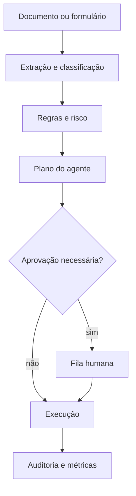

# AI Operations Case Manager

[](https://github.com/viniciusds2020/ai-operations-case-manager/actions/workflows/ci.yml)
[](https://python.org)
[](LICENSE)

Plataforma para receber solicitações corporativas, compreender documentos, aplicar regras, planejar o tratamento com um agente e controlar ações sensíveis com aprovação humana.

O domínio demonstrativo é uma **autorização de procedimento em saúde com dados sintéticos**, mas regras, tipos de caso e ferramentas são configuráveis para seguros, RH, jurídico, atendimento e operações industriais.

## Capacidades

- entrada por PDF, TXT, Markdown ou formulário;
- extração local de texto e classificação explicável;
- validação de campos e regras declarativas por domínio;
- score de risco e decisão automática de human-in-the-loop;
- agente determinístico, auditável e sem custo para desenvolvimento;
- adaptador opcional Groq/Llama para gerar uma síntese, sem delegar decisões críticas;
- fila de revisão, aprovação, rejeição e execução idempotente;
- trilha de auditoria append-only com ator, instante e justificativa;
- dashboard HTML operacional, API FastAPI, SQLite, Docker e CI;
- métricas de volume, automação, risco e tempo de ciclo.

## Fluxo



## Rodar localmente

```bash
python -m venv .venv
source .venv/bin/activate
pip install -e ".[dev]"
uvicorn case_manager.api:app --reload
```

Acesse `http://localhost:8000`. Para usar Groq apenas na geração de síntese:

```bash
export CASE_LLM_PROVIDER=groq
export GROQ_API_KEY=sua_chave
export GROQ_MODEL=llama-3.3-70b-versatile
```

Sem essas variáveis, a solução usa o modo determinístico. Decisão, risco, aprovação e execução nunca dependem da LLM.

## Exemplo

Envie `examples/solicitacao_sintetica.md`. O sistema reconhece uma autorização de saúde, extrai os campos, identifica risco e cria um plano. Os dados são fictícios.

```bash
curl -F "file=@examples/solicitacao_sintetica.md" \
  -F "requester=Portal do Cooperado" http://localhost:8000/api/cases
```

## API

| Método | Endpoint | Uso |
|---|---|---|
| `POST` | `/api/cases` | Criar e analisar um caso |
| `GET` | `/api/cases` | Listar casos |
| `GET` | `/api/cases/{id}` | Consultar caso e eventos |
| `POST` | `/api/cases/{id}/review` | Aprovar ou rejeitar |
| `POST` | `/api/cases/{id}/execute` | Executar plano aprovado |
| `GET` | `/api/metrics` | Métricas operacionais |
| `GET` | `/api/health` | Saúde e provedor ativo |

Documentação OpenAPI: `http://localhost:8000/docs`.

## Segurança e decisões

- arquivos recebem nomes internos e não são expostos diretamente;
- extensão, tamanho e assinatura de PDF são validados;
- conteúdo do documento é tratado como dado, não como instrução;
- ações de alto risco exigem aprovação humana;
- revisão exige ator e justificativa;
- execução é idempotente e registrada;
- segredos e dados operacionais não entram no Git.

Este é um MVP de engenharia e não toma decisões clínicas. Em produção, adicione autenticação corporativa, RBAC, criptografia, retenção, LGPD, filas, storage de objetos e integração transacional real.

## Arquitetura do repositório

```text
src/case_manager/       domínio, regras, agente, persistência e API
src/case_manager/static dashboard operacional
configs/                regras declarativas do domínio
skills/                 skill de triagem de casos
examples/               solicitação fictícia
tests/                  testes de regras, workflow e API
```

## Testes

```bash
ruff check .
pytest
```

## Próximas evoluções

- conectores MCP para e-mail, CRM, SharePoint e sistemas internos;
- PostgreSQL, storage de objetos e workers assíncronos;
- OCRmyPDF/Docling como serviço documental;
- autenticação Entra ID, RBAC e segregação por tenant;
- OpenTelemetry, avaliação de agentes e alertas de SLA;
- feedback humano para retreinamento do classificador.

## Licença

MIT.

